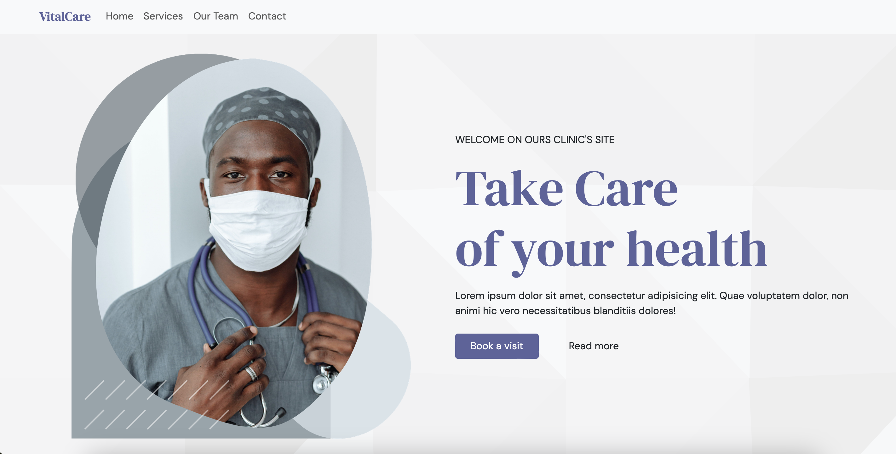

# Welcome to VitalCare Clinic Website 🏥

## Description 📜
VitalCare Clinic Website is a responsive web application developed using React.js and Bootstrap. This platform is designed to provide comprehensive information about the clinic's services, the dedicated team, and how to get in touch with them.

[👉 Explore the live website ](https://vitalcare-clinic.netlify.app)

## Technologies Used 🛠️

### Frontend 🌐

- HTML, CSS, and JavaScript for the front-end user interface.
- React.js as the front-end library for dynamic rendering.
- React Bootstrap: A UI framework that integrates Bootstrap styles and components into React applications, providing a responsive and visually appealing user interface.

Feel free to explore the project and contribute to make it even more amazing! 😊🚀